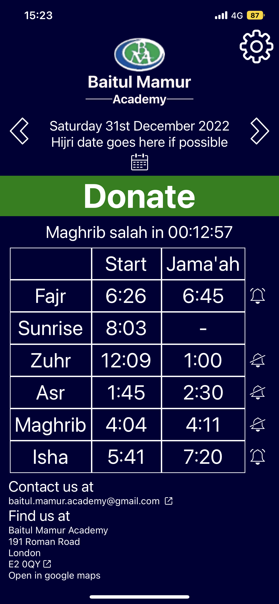

[![Portfolio][portfolio-shield]][portfolio-url]

 

  <h3 align="center">Mosque App</h3>
  

    An app for Baitul Mamur Academy, a Mosque in east London.
  

<!-- ABOUT THE PROJECT -->

## About The Project

### Purpose of project

This project aims to provide information to Mosque attendees through an app. Unlike a website, the app is intended to be offline first enabling attendees to view prayer times even when there is no or weak internet connection. The app also aids by alerting users when it is close to prayer time, leaving adjustements to users allowing them to know in advance when it is prayer times. The app also has a donation and contact section enabling attendees to help and commmunicate with the Mosque.

This app is a personal project and is currently being used by my local Mosque.

### Built With

- [![React Native][React-Native]][React-Native-url]
- [![Stripe API][Stripe-api]][Stripe-url]

<!-- MARKDOWN LINKS & IMAGES -->
<!-- https://www.markdownguide.org/basic-syntax/#reference-style-links -->

[portfolio-shield]: https://img.shields.io/badge/Portfolio-000?style=for-the-badge&logo=web&logoColor=white
[portfolio-url]: https://habibabdulwahid.com/
[React-Native]: https://img.shields.io/badge/React_Native-20232A?style=for-the-badge&logo=react&logoColor=61DAFB
[React-Native-url]: https://reactnative.dev/
[Stripe-api]: https://img.shields.io/badge/Stripe-API-blue?style=for-the-badge&logo=stripe&logoColor=white
[Stripe-url]: https://stripe.com/docs/api
